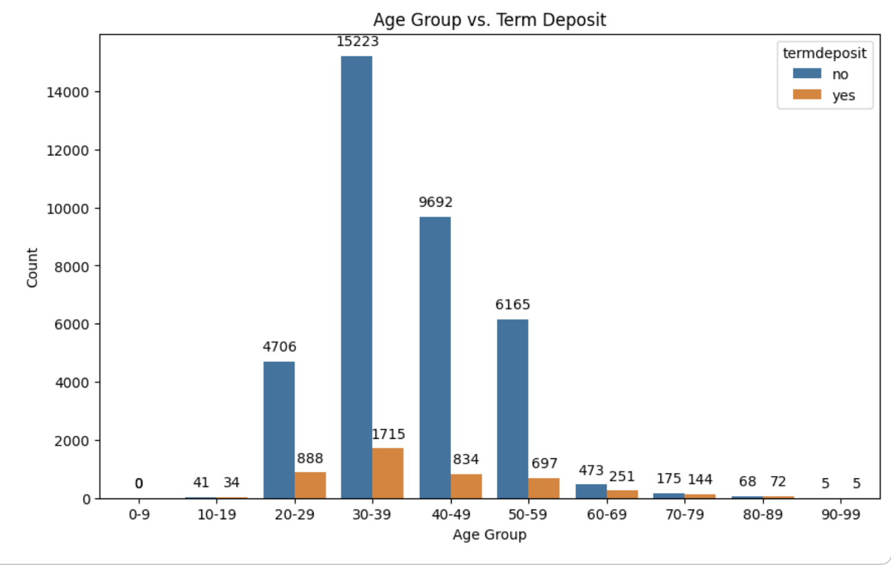
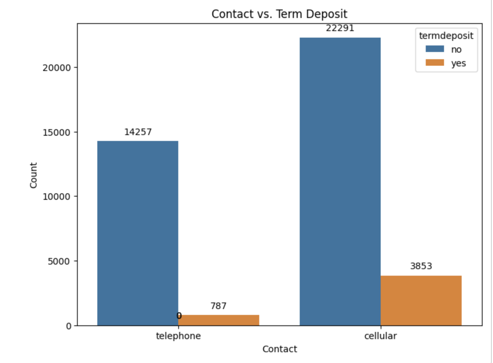
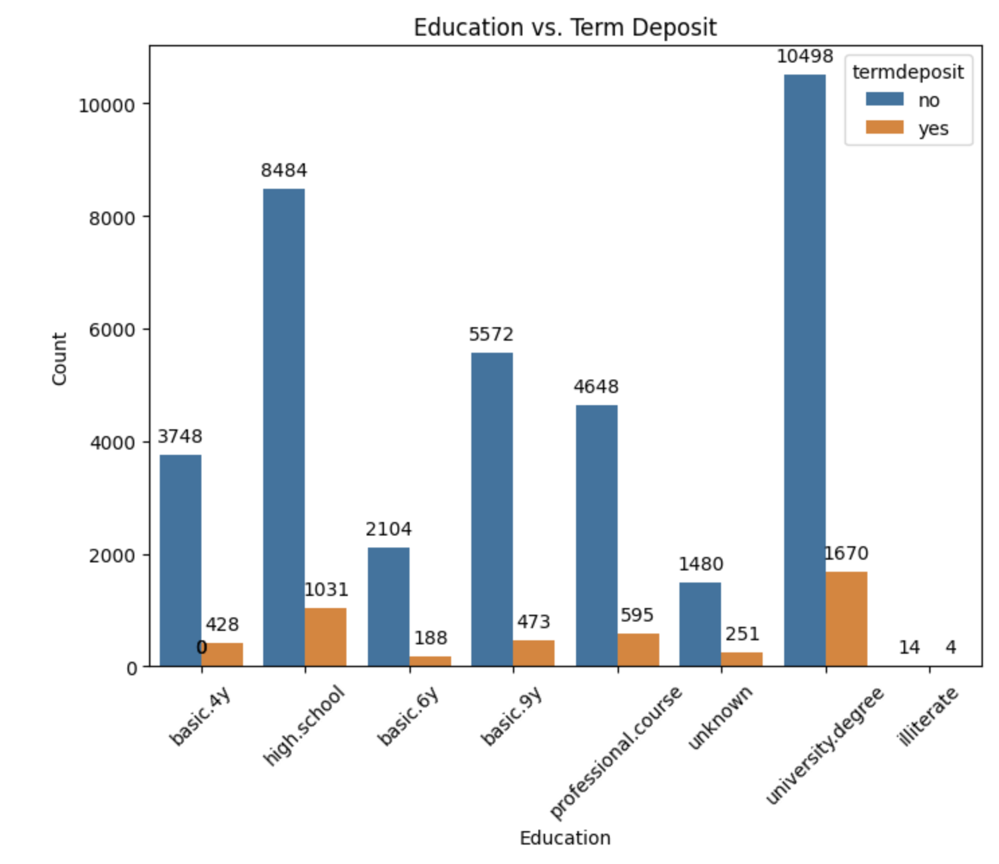
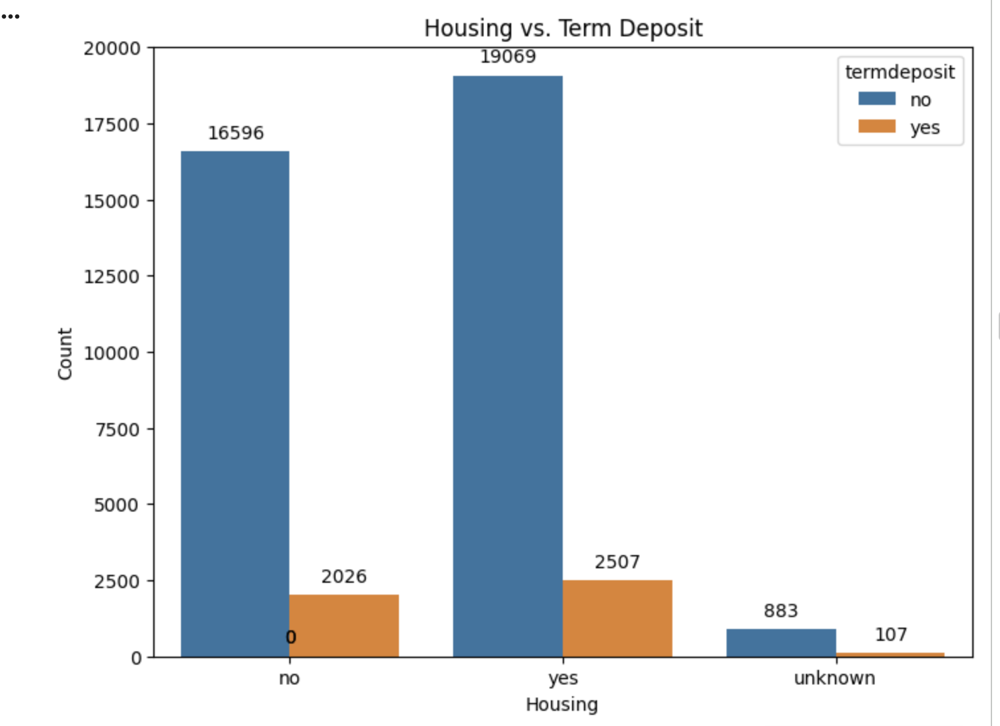
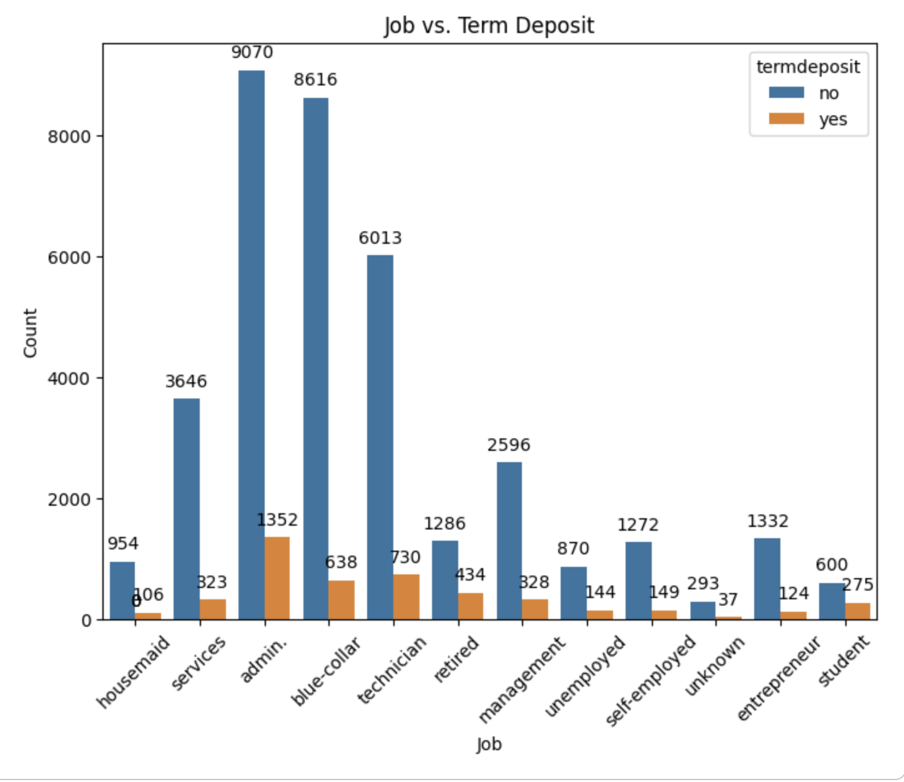
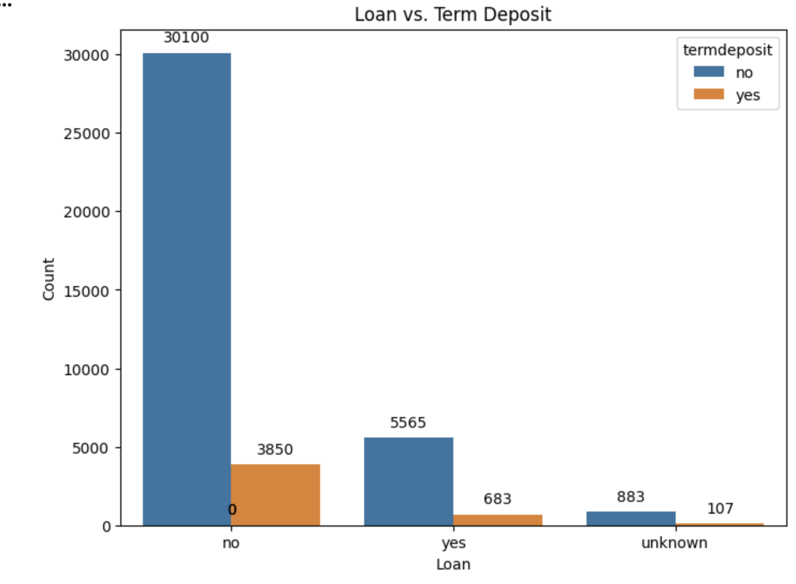
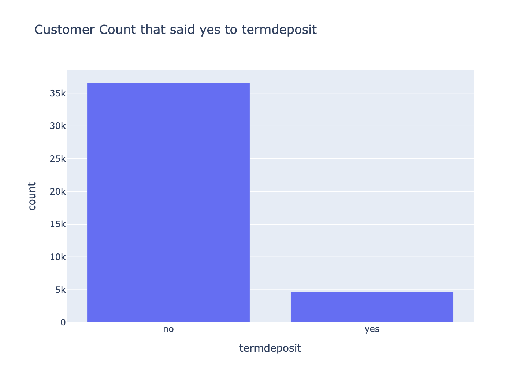
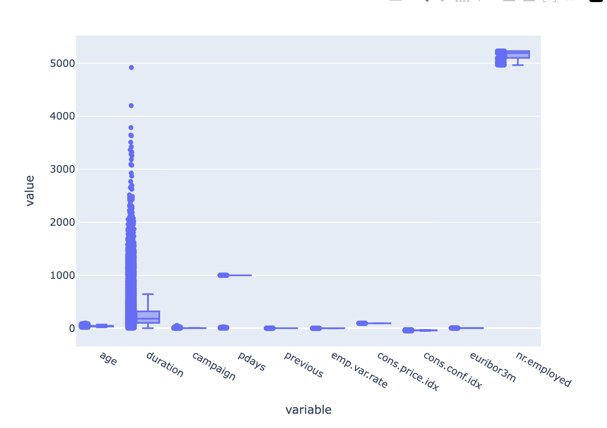
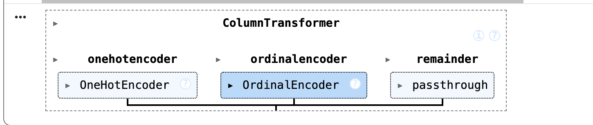

# Introduction
This repository contains practical Application Assignment III (module 17). It uses  the UCI Bank Marketing Dataset (bank-additional-full.csv, located in the data folder). The notebook builds and evaluates classification models to predict which customers are likely to accept a long-term deposit offer, based on features such as job, marital status, education, housing loan, and personal loan.

The project compares the performance of the following classifiers:

Logistic Regression
K-Nearest Neighbors (KNN)
Decision Trees
Support Vector Machines (SVM)

For all models, both training time and accuracy are recorded to assess the classifier which performs best in predicting customer responses during a phone-based marketing campaign.  GridSercvCV is used for each model to compate the results.

According to the Materials and Methods section, the number of marketing campaigns that the data represents is 17 , the exact exceprt is "The dataset collected is related to 17 campaigns that occurred between May 2008 and November 2010, corresponding to a total of 79354 contacts."

# Observations
With respect to varius features following observationa were made on the data
Education - for the termdeposit the bank was successul to seel the product to university degree folks
Job - for the term deposit the bank wbank had the most success with folks in admin role,followed by Technician and then blue-collar
Marital Status - for the termdeposit the bank was successful to sell the product to married vs single
Housing - Not significat difference between customers have mortagage loan or not
Contact - For the termdeposit the bank was successful to sell the product to cellphone users vs telephone users

To support the above observations following are the main charts

# Business Objective 
From a business objective, of the task is to determine the factors could lead to a higher success rate, for example,
The business goal is to identify the factors that lead to a higher campaign success rate. including factors like housing mortgage, contact method (cell phone, telephone), personal loans, age , job, university degree etc.
The campaigns show some success in some categories but the results doesn't seem to be too successful.

# Model Comparison Results
For the baseline model, decided to use a DummyClassifer which is a very good choice as it just separates the classes.

Following column transformer was created for the pipelines

This model was compared with a Logistic Regression model, a statistical method used to examine how one or more independent variables influence a categorical dependent variable.

In training, fitting and predicting both models on the dataset, the following results were observed:

Analysis of the  results from the model comparison, Logistic Regression out-performed all other models with lowest train time in seconds, highest training and testing accuracy scores.

# GridSearchCV Based Model Improvements
The following improvements were seen after running the different models to find the best hyperparameters for the models

Improved LinearRegressions Results 
Logistic Regression Accuracy: 0.886501578 
Best Parameters {'model__C': 0.01, 'model__penalty': 'l1', 'model__solver': 'liblinear'} 
Training Accuracy LR En 0.887556904400607 
Test Accuracy LR En 0.8865015780529255

Improved KNN Results 
GS KNN Accuracy: 0.886137412 
Best parameters {'model__n_neighbors': 18} 
Training Accuracy KNN En 0.8880121396054628 
Test Accuracy KNN En 0.8861374119932023

Improved DT Results 
GS DT Accuracy: 0.886501578 
Best Parameters {'model__criterion': 'gini', 'model__max_depth': 3, 'model__min_samples_leaf': 1} 
Training Accuracy DT En 0.887556904400607 
Test Accuracy DT En 0.8865015780529255

